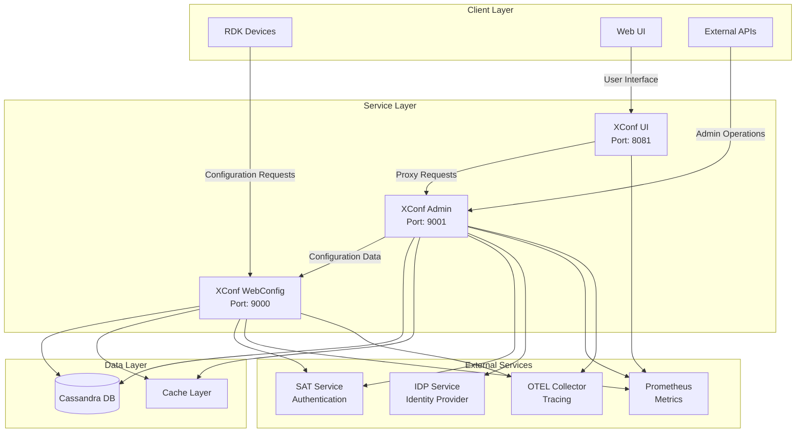
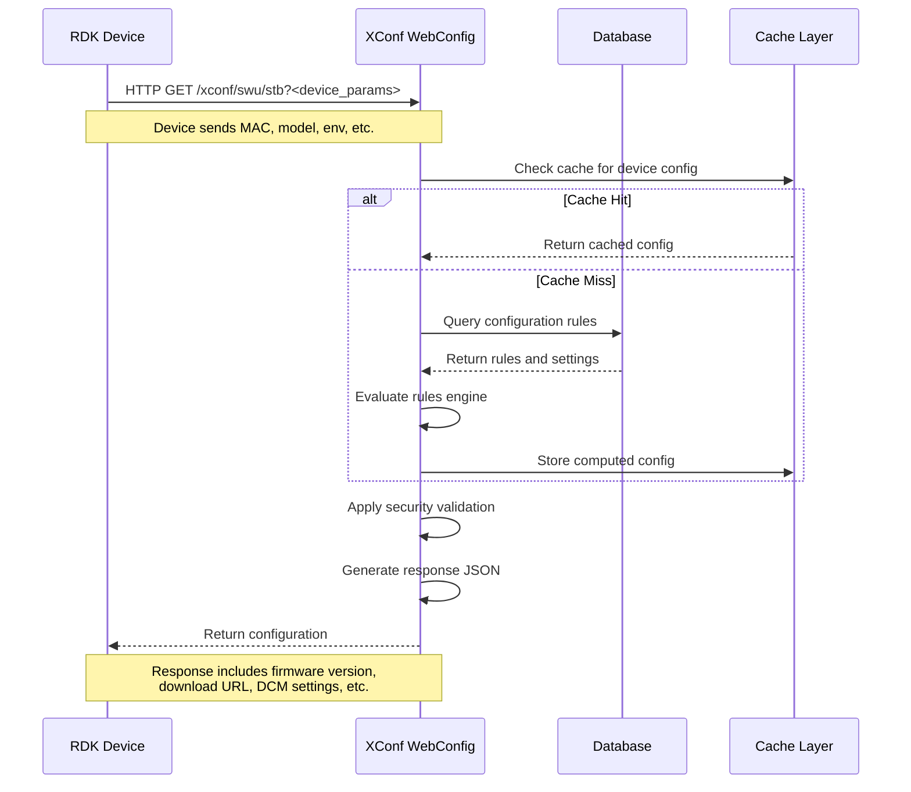
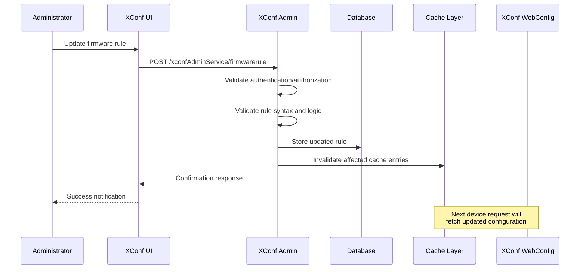
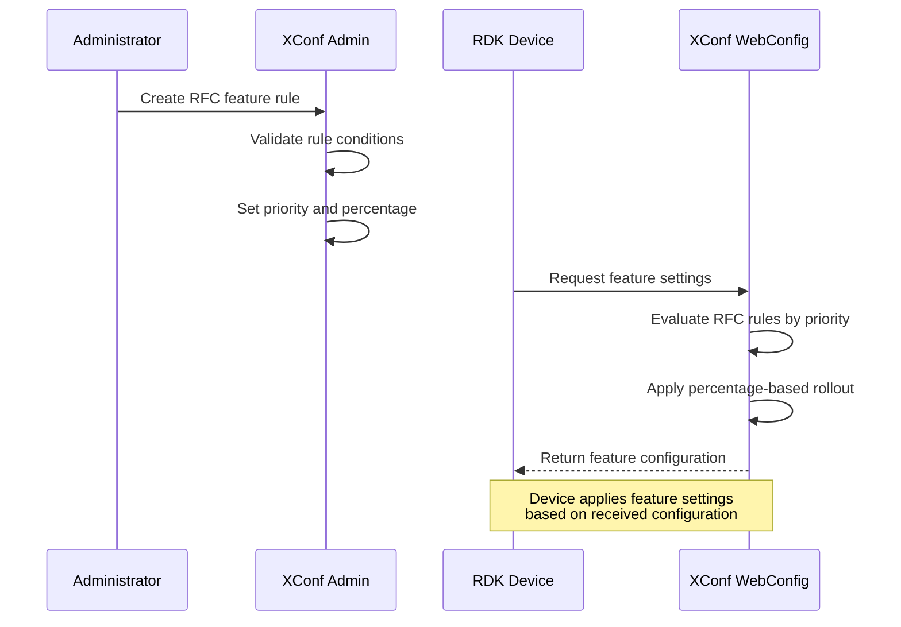
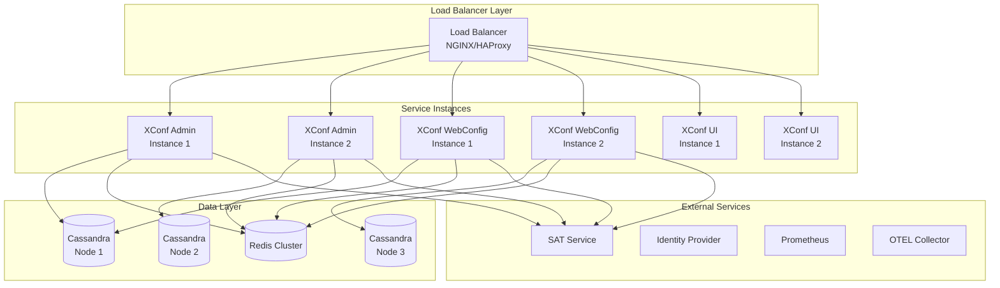

# XConf System Overview

## Table of Contents
- [Overview](#overview)
- [System Architecture](#system-architecture)
- [Core Components](#core-components)
- [Process Flow Diagrams](#process-flow-diagrams)
- [Use Cases](#use-cases)
- [API Overview](#api-overview)
- [Configuration Management](#configuration-management)
- [Deployment Architecture](#deployment-architecture)
- [Security Model](#security-model)
- [Getting Started](#getting-started)

## Overview

XConf is a comprehensive configuration management platform designed for RDK (Reference Design Kit) devices. It provides centralized control over device configurations, firmware updates, telemetry settings, and feature management across large-scale RDK deployments. The system is built with Go and follows a microservices architecture with three main components working together to deliver a complete configuration management solution.

### Key Features
- **Centralized Configuration Management**: Single point of control for all device configurations
- **Firmware Management**: Control firmware distribution and updates with canary deployments
- **Telemetry Services**: Manage telemetry profiles and data collection policies
- **Device Control Manager (DCM)**: Handle device control settings and log upload policies
- **Feature Management**: Control feature flags and rules with priority-based evaluation
- **Authentication & Authorization**: JWT-based security with role-based access control
- **RESTful APIs**: Comprehensive REST APIs for all operations
- **Metrics & Monitoring**: Built-in Prometheus metrics and OpenTelemetry tracing support
- **High Availability**: Distributed locking and caching for scalable operations

## System Architecture

The XConf system follows a three-tier architecture with clear separation of concerns:



### Architecture Principles
- **Microservices Design**: Each component has a specific responsibility
- **Stateless Services**: All services are stateless for horizontal scalability
- **Event-Driven**: Asynchronous processing for configuration changes
- **Security First**: Multiple layers of authentication and authorization
- **Observability**: Built-in metrics, logging, and distributed tracing

## Core Components

### 1. XConf Admin (`xconfadmin`)
**Purpose**: Administrative backend service for configuration management

**Key Capabilities**:
- Configuration CRUD operations (firmware, DCM, telemetry, RFC)
- Rule-based configuration management with priority handling
- User authentication and authorization
- Change management and audit logging
- API gateway for administrative functions

**Main Modules**:
- `adminapi/`: REST API handlers and routing
- `auth/`: Authentication and authorization services
- `firmware/`: Firmware configuration management
- `dcm/`: Device Control Manager settings
- `telemetry/`: Telemetry profile management
- `rfc/`: RDK Feature Control management
- `queries/`: Query and reporting services

### 2. XConf WebConfig (`xconfwebconfig-main`)
**Purpose**: Data service for RDK devices to retrieve configurations

**Key Capabilities**:
- High-performance configuration delivery to RDK devices
- Rule engine for dynamic configuration evaluation
- Firmware version determination and distribution control
- Telemetry and DCM settings delivery
- Health checks and diagnostics

**Main Modules**:
- `dataapi/`: Device-facing API endpoints
- `rulesengine/`: Configuration rule evaluation
- `db/`: Database abstraction and caching
- `security/`: Request validation and security
- `tracing/`: Distributed tracing implementation

### 3. XConf UI (`xconfui-main`)
**Purpose**: Web-based user interface for system administration

**Key Capabilities**:
- Interactive web interface for configuration management
- Proxy service to XConf Admin backend
- Static asset serving (HTML, CSS, JavaScript)
- User session management

**Main Modules**:
- `app/`: Angular-based web application
- `server/`: Go-based proxy server
- `templates/`: HTML templates

## Process Flow Diagrams

### Device Configuration Request Flow



### Administrative Configuration Update Flow



### Feature Flag Management Flow



## Use Cases

### 1. Firmware Management
**Scenario**: Rolling out new firmware to RDK devices
- **Actors**: Operations team, RDK devices
- **Process**: 
  1. Upload firmware configuration with version and download URLs
  2. Create firmware rules targeting specific device models/environments
  3. Configure percentage-based rollout (canary deployment)
  4. Devices request current firmware version and receive updates
  5. Monitor rollout progress and device health

### 2. Device Configuration Management (DCM)
**Scenario**: Managing log upload policies and device settings
- **Actors**: Support team, RDK devices
- **Process**:
  1. Define log upload schedules and retention policies
  2. Configure device settings (reboot schedules, URLs)
  3. Create DCM formulas with conditional logic
  4. Devices receive settings based on their characteristics
  5. Automated log collection based on policies

### 3. Feature Flag Control (RFC)
**Scenario**: Gradual feature rollout with targeted activation
- **Actors**: Product team, RDK devices
- **Process**:
  1. Create feature control rules with targeting conditions
  2. Define percentage-based rollout strategy
  3. Set feature parameters and default values
  4. Devices query feature settings on startup/periodically
  5. Features activate based on device match and rollout percentage

### 4. Telemetry Configuration
**Scenario**: Configuring data collection and reporting
- **Actors**: Analytics team, RDK devices
- **Process**:
  1. Define telemetry profiles with metrics and collection intervals
  2. Create targeting rules for different device segments
  3. Configure data upload schedules and endpoints
  4. Devices receive telemetry configuration
  5. Automated data collection and reporting

### 5. Environment-Specific Configurations
**Scenario**: Managing different settings across development, staging, and production
- **Actors**: DevOps team, RDK devices across environments
- **Process**:
  1. Define environment-specific configuration rules
  2. Set different firmware versions, URLs, and policies per environment
  3. Devices automatically receive appropriate configuration based on environment
  4. Seamless promotion of configurations across environments

## API Overview

### XConf Admin API (`/xconfAdminService`)
**Authentication**: JWT tokens or session-based authentication
**Base URL**: `http://host:9001/xconfAdminService`

**Key Endpoints**:
- `GET/POST/PUT/DELETE /firmwareconfig` - Firmware configuration management
- `GET/POST/PUT/DELETE /firmwarerule` - Firmware rule management
- `GET/POST/PUT/DELETE /dcm/formula` - DCM formula management
- `GET/POST/PUT/DELETE /telemetry/profile` - Telemetry profile management
- `GET/POST/PUT/DELETE /rfc/feature` - Feature rule management
- `GET /queries/environments` - Environment queries
- `POST /auth/basic` - Basic authentication
- `GET /provider` - Authentication provider info

### XConf WebConfig API (`/xconf`)
**Authentication**: Device-based validation
**Base URL**: `http://host:9000/xconf`

**Key Endpoints**:
- `GET /swu/stb` - Firmware configuration for STB devices
- `GET /loguploader/getSettings` - Log upload settings
- `GET /rfc/feature/getSettings` - Feature settings
- `GET /telemetry/getTelemetryProfiles` - Telemetry profiles
- `GET /dcm/getSettings` - DCM settings

### Request/Response Examples

**Device Firmware Request**:
```bash
GET /xconf/swu/stb?eStbMac=AA:BB:CC:DD:EE:FF&model=MODEL_X&env=PROD
```

**Firmware Response**:
```json
{
  "firmwareVersion": "2.1.0",
  "firmwareDownloadURL": "https://firmware.example.com/firmware-2.1.0.bin",
  "firmwareFilename": "firmware-2.1.0.bin",
  "rebootImmediately": false,
  "forceHttp": false
}
```

## Configuration Management

### Configuration Hierarchy
1. **Global Defaults**: System-wide default configurations
2. **Environment-Specific**: Dev, staging, production overrides
3. **Model-Specific**: Device model-based configurations
4. **Device-Specific**: Individual device overrides

### Rule Engine
- **Conditional Logic**: Support for complex boolean expressions
- **Priority System**: Higher priority rules override lower priority ones
- **Percentage Rollouts**: Gradual deployment based on percentages
- **Temporal Controls**: Time-based activation and expiration

### Configuration Types
- **Firmware Rules**: Control firmware versions and distribution
- **DCM Formulas**: Device control and log upload policies
- **RFC Features**: Feature flags and experimental settings
- **Telemetry Profiles**: Data collection and reporting configurations
- **Setting Profiles**: General device settings and parameters

## Deployment Architecture

### Recommended Deployment Pattern



### Infrastructure Requirements
- **Compute**: Minimum 2 CPU cores, 4GB RAM per service instance
- **Storage**: SSD storage for database with replication
- **Network**: High-bandwidth connection for firmware distribution
- **Cache**: Redis cluster for high-performance caching
- **Database**: Cassandra cluster with minimum 3 nodes for HA

### Scaling Considerations
- **Horizontal Scaling**: Stateless services support easy horizontal scaling
- **Database Sharding**: Cassandra provides automatic sharding and replication
- **Cache Strategy**: Multi-level caching with Redis and in-memory caches
- **Load Distribution**: Geographic distribution for global deployments

## Security Model

### Authentication Layers
1. **Service-to-Service**: SAT (Security Access Token) based authentication
2. **User Authentication**: Integration with enterprise identity providers
3. **Device Authentication**: MAC address and certificate-based validation
4. **API Security**: JWT tokens with role-based access control

### Authorization Framework
- **Entity-Based Permissions**: Granular permissions per configuration entity
- **Role-Based Access Control**: Predefined roles with specific capabilities
- **Operation-Level Security**: Read/write permissions per API endpoint
- **Environment Isolation**: Strict separation between environments

### Security Features
- **Token Validation**: Comprehensive JWT token validation and refresh
- **Request Sanitization**: Input validation and sanitization
- **Audit Logging**: Complete audit trail for all configuration changes
- **Secure Communication**: HTTPS/TLS for all service communications

## Getting Started

### Prerequisites
- **Go 1.23+**: For building and running the services
- **Cassandra 3.11+**: For data persistence
- **Redis**: For caching (optional but recommended)
- **Node.js 24.1.0+**: For UI development
- **Git**: For source code management

### Quick Start

1. **Clone Repositories**:
```bash
git clone https://github.com/rdkcentral/xconfadmin.git
git clone https://github.com/rdkcentral/xconfui.git
git clone https://github.com/rdkcentral/xconfwebconfig.git
```

2. **Start Database**:
```bash
# Start Cassandra and create schema
cassandra -f &
cqlsh -f xconfwebconfig-main/db/db_init.cql
```

3. **Configure Services**:
```bash
# Copy and modify configuration files
cp xconfadmin/config/sample_xconfadmin.conf /etc/xconf/xconfadmin.conf
cp xconfwebconfig-main/config/sample_xconfwebconfig.conf /etc/xconf/xconfwebconfig.conf
cp xconfui-main/config/sample_xconfui.conf /etc/xconf/xconfui.conf
```

4. **Build and Run Services**:
```bash
# Build XConf Admin
cd xconfadmin && make build
./bin/xconfadmin-linux-amd64 -f /etc/xconf/xconfadmin.conf &

# Build XConf WebConfig
cd xconfwebconfig-main && make build
./bin/xconfwebconfig-linux-amd64 -f /etc/xconf/xconfwebconfig.conf &

# Build and Run XConf UI
cd xconfui-main
npm install && grunt install
go run *.go -f /etc/xconf/xconfui.conf &
```

5. **Access the System**:
- **Admin UI**: http://localhost:8081
- **Admin API**: http://localhost:9001/xconfAdminService
- **WebConfig API**: http://localhost:9000/xconf

### Configuration Tips
- Set environment variables for SAT_CLIENT_ID, SAT_CLIENT_SECRET, and SECURITY_TOKEN_KEY
- Configure appropriate log levels for production deployments
- Enable metrics and tracing for production monitoring
- Use environment-specific configuration files
- Implement proper backup strategies for Cassandra

### Development Workflow
1. Make changes to source code
2. Run unit tests: `go test ./...`
3. Build and test locally
4. Deploy to staging environment
5. Run integration tests
6. Deploy to production with canary rollout

This overview provides a comprehensive understanding of the XConf system architecture, components, and operational patterns. For detailed API documentation, refer to the individual API documentation files in each component directory.